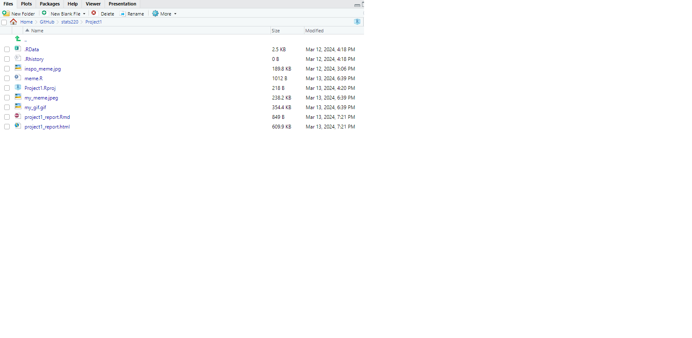
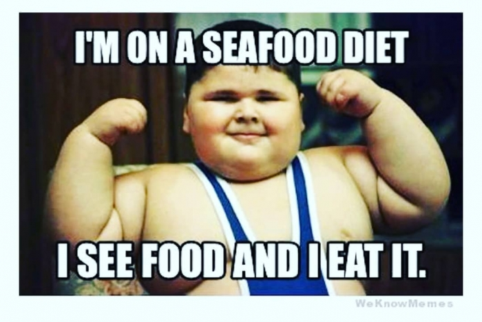
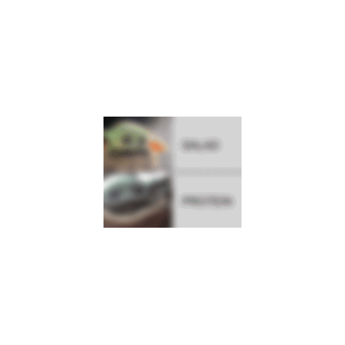

```{r setup, include=FALSE}
knitr::opts_chunk$set(echo=TRUE, message=FALSE, warning=FALSE, error=FALSE)
```

```{css}
body{background-color: #A9A9A9}

p{color:#FFFFFF;
  font-family: "Lucida Console", "Courier New", monospace;}
  
h2: {font-family: }  

```

## Project requirements

I have met the github requirements by having an account as well as setting up a repository called 'stats220'.
Inside my repository I have a readme file with a description of the purpose of the repository. In my readme file i have used different levels of headers, bullet points, as well as included the use of bold, italics and links to websites.

 


The link to my stats220 repository is [here](https://github.com/hsir571/stats220).

The link to my website is [here](https://github.com/hsir571).


## My meme

```{r meme-code, eval=TRUE}
library(magick)

#make a vector with a string 
text <- c("SALAD")

#read image in 
new_meme <- image_read('https://i.imgflip.com/51x3pf.jpg?a474384') %>%
  image_annotate( 
    text, size = 100, location = "+700+200") %>%  #add text to the image 
  image_annotate( 
    "PROTEIN", size = 100, location = "+700+700")  
print(new_meme)
```





I changed the image and the text completely and created a brand new meme. The part I kept the same was that it was funny and my meme is also funny ahahhaha. 
```{r animation-code, eval=FALSE}
library(magick)

#make a vector with a string 
text <- c("SALAD")

#read image in 
new_meme <- image_read('https://i.imgflip.com/51x3pf.jpg?a474384') %>%
  image_annotate( 
    text, size = 100, location = "+700+200") %>%  #add text to the image 
  image_annotate( 
    "PROTEIN", size = 100, location = "+700+700") 
  

frame1 <- new_meme %>%
  image_scale(200) %>%
  image_blur(10,5) %>%
  image_extent("500x500")

frame2 <- new_meme %>%
  image_scale(300) %>%
  image_noise() %>%
  image_extent("500x500") 

frame3 <- new_meme %>%
  image_scale(400) %>%
  image_charcoal() %>%
  image_extent("500x500")

frame4 <- new_meme %>%
  image_noise() %>%
  image_scale(500)

# putting the frames in order using a vector
frames <- c(frame1, frame2, frame3, frame4)

# creating an animation
my_gif <- image_animate(frames, fps = 1)


image_write(my_gif,"my_gif.gif")

```



## Creativity
  My project demonstrates creativity because I was asked to take a meme and modify parts of it. However I am so utterly insanely creative that I ended up creating a brand new meme. When turning this meme into a gif I have used effects that were not gone over in the lectures but I found in the on cran. 

## Learning reflection

From doing this project I have learned a lot about R and realized that it is not just for statistics. It seems that there are many different packages within R that allow you to utilize it for a variety of things. Mark Down simplifies the process of creating html pages a lot and makes it more accessible to people that may not be the greatest at coding. 

Some thing I would be interested in exploring further in data technologies is the training of AI and machine learning. The future will probably be dominated by AI so learning about it early would be helpful! 