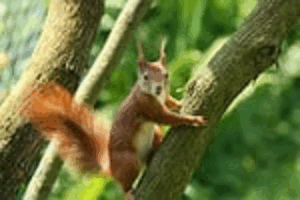

```{r setup, include=FALSE}
knitr::opts_chunk$set(echo=TRUE, message=FALSE, warning=FALSE, error=FALSE)
library(tidyverse)
photo_data <- read_csv('selected_photos.csv')


```

```{css, echo=FALSE}
body{
  background-color:darkgrey; 
}

p{
  padding: 15px; 
}
```

## Introduction

The two words I chose were "Flying" and "Squirrel". The reason I chose these words is because in the project outline "cute       cats" was used as an example so I chose a different animal and chose an adjective. 

  

  
<br>
  
The photos tend to all be landscape photos. All of them tend to have primarily green and brown colours in them. All of them are   tagged with 'squirrel' and most of them are tagged with 'rodent'. The likes on the photos tend to vary from around 120 - 220     likes. The range on the number of views is quite large with half being around 110,000 and the other half having around 10,000. 


```{R}


selected_urls <- select(photo_data, pageURL)
knitr::kable(selected_urls, caption = "Selected Photo URLs")

```



## Key features of selected photos

1. On average there was a `r mean(photo_data$viewsvsdownloads) *100`% chance that if the person viewed the image they would also download it. 


2. The chance that a person would leave a comment on a photo was `r mean(photo_data$viewsvscomments) *100`% on average. 


3. The average number of likes for the selected photos is `r mean(photo_data$likes) %>% round()`, indicating the level of           engagement they receive from viewers.
  
4. The average number if views for the selected photos were `r format(mean(photo_data$views, na.rm = TRUE), scientific = FALSE)`
  

  
## Creativity

```{r}
ggplot(photo_data, aes(x = views, y = comments)) +
geom_point(color = "blue", alpha = 0.5) +
labs(title = "Views vs. Comments for Selected Photos",
       x = "Views", y = "Comments") 


```

```{r}

ggplot(photo_data, aes(x = views, y = downloads)) +
geom_point(color = "blue", alpha = 0.5) +
labs(title = "Views vs. Downloads for Selected Photos",
       x = "Views", y = "Downloads") 


```

To demonstrate creativity I have made some scatter plots to show the relationship between views with comments and downloads. I had to look into how to make scatter plots as only bar graphs were taught in lectures.


## Learning reflection

One important idea I learned from module 3 was the creation of new variables using old variables. This idea is important because sometimes the original variables that you have gathered are not that useful for interpretation. But if we look at the means or medians of those variables or use ifelse to categorise them, they can become more useful to us.

Something I am curious about that I would like to explore is seeing what other websites out there have search APIs up and available for people to use. I think it would be cool to see what you could do with these APIs and how they are used in the world today. 


## Appendix 

```{r file='exploration.R', eval=FALSE, echo=TRUE}

```
